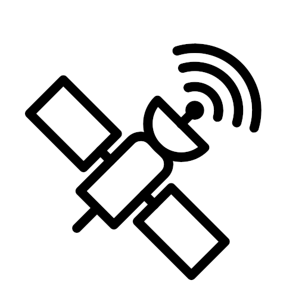

# Satellite
Satellite is a SAT-solver.



## Installing
### Linux
Download the project, go to project's root, and run the file `build.sh` :
```bash
chmod u+x build.sh
./build.sh
```

Note : you need to have `gcc` installed on your computer.

### Windows
Download the project, go to project's root, and execute the file `build.sh` with `Cygwin`.

Note : you need to have [Cygwin](https://www.cygwin.com) installed with `gcc` on your computer.

### Running
Once compiled, go to the folder `build`, open a terminal, and you can use the executable `SATellite` (or `SATellite.exe` on windows).

## Usage
### Command line arguments
```
./SATellite -h
Usage : ./SATellite [-h] [-v] [-a ALGO] [-H HEUR] FILE

Show whatever the input formula is satisfiable, and if so, show a model of it.

Positional arguments :
    FILE                         Path to a cnf formula encoded in DIMACS format

Optional arguments :
    -h, --help                   Show this help message and exit
    -v, --version                Show version and exit
    -a ALGO, --algorithm ALGO    Select solver algorithm. Default is 'quine'
        'quine'
        'dpll'
        
    -H HEUR, --heuristic HEUR    Select an heuristic for DPLL algorithm.
        'random'                 Ignored if ALGO is not 'dpll'.
        'freq'
                                 
```

### Heuristic description
- `random` : select randomly a literal ;
- `freq` : select the most frequent literal to build a model ;

...

### Output description
Todo

## Implementation choices
### Data structure

We represent the literals as integer (positive for a variable, negative for its negation).

To represent formulae under cnf, we use two nested structures :
- `clause` which represent a clause. It contain an int list (the literal list) and the size of the list ;
- `CNF` which represent the formula. It contain a clause list, the clause count and the variable count.


## Authors
- [Louis TG](https://github.com/lasercata)
- [Enzo J](https://github.com/Prog-up)
- [Câline F](https://github.com/Naory03)

## Licence
Todo
